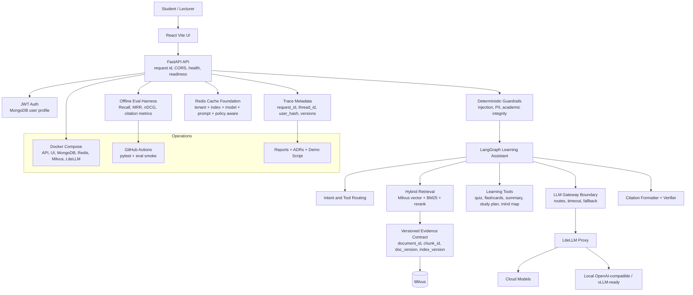
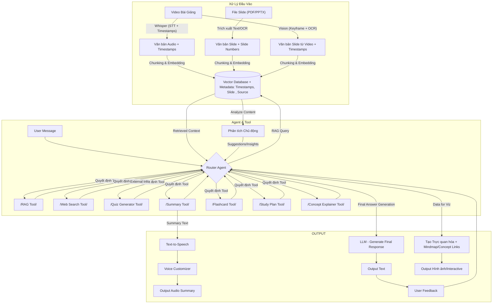

# EduMentor AI - Production RAG/LLMOps

> Status: da di qua du cac phase bang vertical slices co test va commit. Chua phai full production-live, vi mot so acceptance gates van can runtime integration, benchmark, dashboard va deploy that.

## Production Architecture



## Phase Status

| Phase | Status | Evidence |
| --- | --- | --- |
| 00. Plan | Done | `plans/20260810-edumentor-production-rag-llmops/` |
| 00A. Repo cleanup | Done | `docs/repository-structure.md`, clean package markers |
| 01. Production baseline | Done slice | `config/settings.py`, health/readiness, request id, pytest |
| 02. Evidence contract | Done slice | deterministic document/chunk/index ids, normalized sources |
| 03. Offline eval | Done smoke | eval harness + 3-row baseline; full 80-120 row dataset pending |
| 04. LLM gateway | Done boundary | LiteLLM config and client; full graph migration pending |
| 05. Guardrails | Done slice | deterministic policy and citation verifier; tool sandbox pending |
| 06. Cache | Done contract | version-aware cache keys; runtime retrieval cache pending |
| 07. Checkpointing | Done contract | thread/checkpoint model; LangGraph checkpointer pending |
| 08. Observability | Done contract | trace metadata and redaction; live Langfuse spans pending |
| 09. Deployment | Done skeleton | Docker/Compose/CI/runbook; fresh VM, HTTPS, backup/load pending |
| 10. Portfolio evidence | Done docs | ADRs, architecture, final report, demo script |

## Quick Verification

```powershell
python -m pytest -q
python -m evals.run_eval --dataset evals/datasets/edumentor_v1.jsonl --output reports/eval-baseline-v1.json
docker compose config
```

## Legacy Concept Diagram




## Cấu trúc API

API được thiết kế với 3 endpoint chính:

### 1. `/upload` - Xử lý và lập chỉ mục tài liệu

**Quy trình:**
- Sinh viên upload file (PDF, PPTX, DOCX, v.v.)
- File được lưu vào thư mục uploads
- Xử lý file đồng bộ:
  - Trích xuất văn bản (PDF → PyMuPDF, PPTX → python-pptx, DOCX → python-docx)
  - Chia nhỏ (chunking) bằng RecursiveCharacterTextSplitter
  - Tạo embedding bằng SentenceTransformer
  - Lưu vào Milvus với metadata (slide number, source)
- Trả về kết quả (số tài liệu đã thêm)

### 2. `/ask` - Truy vấn thông tin

**Quy trình:**
- Gọi LearningAssistant.answer
- intent_analyzer_node phân tích ý định
- Nếu là câu hỏi thông thường → RAG (truy xuất từ Milvus → sinh câu trả lời)
- Nếu cần tool → định tuyến đến công cụ (quiz, flashcards, v.v.)
- Trả về response với metadata (sources, slide number)

### 3. `/tools` - Sử dụng công cụ học tập

**Quy trình:**
- Gọi công cụ trực tiếp qua ToolRegistry.execute_tool
- Công cụ cũng có thể truy xuất ngữ cảnh từ Milvus (nếu cần, ví dụ: Quiz_Generator)

## Các công cụ hỗ trợ

- **Quiz_Generator**: Tạo câu hỏi trắc nghiệm từ tài liệu
- **Flashcard_Generator**: Tạo thẻ ghi nhớ
- **Study_Plan_Creator**: Tạo kế hoạch học tập
- **Concept_Explainer**: Giải thích khái niệm
- **Summary_Generator**: Tạo tóm tắt
- **Mind_Map_Creator**: Tạo sơ đồ tư duy
- **Progress_Tracker**: Theo dõi tiến độ học tập

## Cải tiến

1. **Xử lý tài liệu đa dạng**:
   - Hỗ trợ nhiều định dạng: PDF, PPTX, DOCX, TXT
   - Trích xuất văn bản với các thư viện chuyên biệt
   - Lưu trữ metadata phong phú (slide number, source)

2. **Retrieval thông minh**:
   - EnsembleRetriever kết hợp tìm kiếm vector và BM25
   - Cải thiện độ chính xác khi truy xuất thông tin

3. **Agent Router thông minh**:
   - Phân tích ý định người dùng
   - Định tuyến đến công cụ phù hợp
   - Tích hợp RAG cho câu trả lời chính xác

 
# Production RAG/LLMOps Evidence

This repository now includes a production hardening plan and first implementation slices:

- Plan: `plans/20260810-edumentor-production-rag-llmops/`
- Architecture: `docs/architecture.md`
- Deployment guide: `docs/deployment.md`
- Self-hosting guide: `docs/self-hosting.md`
- CV evidence map: `docs/cv-production-evidence.md`
- Eval harness: `evals/`
- Reports: `reports/`
- Tests: `python -m pytest -q`
- Compose validation: `docker compose config`

Current verified baseline: config/security tests, health/readiness tests, evidence ID contract, offline eval metrics, LLM gateway boundary, deterministic guardrails, cache key contract, checkpoint contract, observability metadata, and deployment skeleton.
