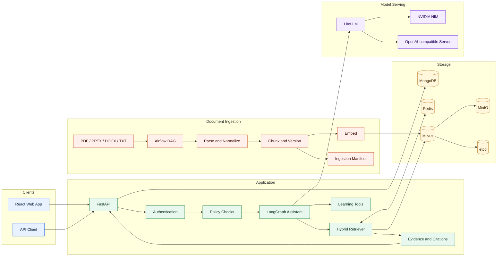

# EduMentor AI

EduMentor AI is a document-grounded learning assistant for course materials. It combines hybrid retrieval, a LangGraph workflow, and focused study tools behind a FastAPI API and React interface.

## Overview

The system supports two main workloads:

- Online learning requests: question answering, summaries, quizzes, flashcards, study plans, concept explanations, mind maps, and progress tracking.
- Offline document ingestion: scheduled parsing, chunking, embedding, indexing, and manifest generation through Apache Airflow.

The application is designed to run as a self-hosted Docker Compose stack. Model calls are routed through LiteLLM to NVIDIA NIM or another OpenAI-compatible endpoint.

## Features

- Hybrid retrieval using Milvus vector search, BM25, weighted merging, and reranking.
- Stable document, chunk, document-version, and index-version identifiers.
- Redis retrieval cache scoped by tenant, index, model, prompt, and policy versions.
- LangGraph orchestration for intent routing, retrieval, tool execution, and response generation.
- LiteLLM gateway with logical model routes, timeouts, retries, and fallback support.
- JWT authentication with MongoDB-backed users and conversation history.
- Input policy checks for prompt injection, PII requests, and academic-integrity workflows.
- Tool allowlists, execution timeouts, and output-size limits.
- Liveness, readiness, request IDs, structured logs, and optional Langfuse tracing.
- Airflow ingestion DAG with CeleryExecutor and a PostgreSQL metadata database.
- Offline retrieval evaluation with Recall@K, MRR, and nDCG.

## Architecture



### Online request flow

1. FastAPI authenticates the request and assigns a request ID.
2. Policy checks evaluate the input before it enters the assistant workflow.
3. LangGraph routes the request to retrieval, a learning tool, or direct response generation.
4. Retrieval combines vector and BM25 results, applies reranking, and retains source metadata.
5. Model requests go through LiteLLM using an OpenAI-compatible API contract.
6. The API returns the response with available source references.

### Ingestion flow

1. Source files are placed in `ingest_data/source_documents/`.
2. The `edumentor_ingest_documents` DAG discovers and processes supported files.
3. Documents are normalized, chunked, assigned stable identifiers, and embedded.
4. Chunks and metadata are written to Milvus.
5. The pipeline writes `ingest_data/reports/manifest.json` for run tracking and idempotency.

## Technology Stack

| Layer | Technologies |
| --- | --- |
| Frontend | React, Vite, Tailwind CSS, Nginx |
| API | FastAPI, Uvicorn, Pydantic |
| Workflow | LangGraph, LangChain |
| Retrieval | Milvus, BM25, Sentence Transformers |
| Model gateway | LiteLLM, NVIDIA NIM, OpenAI-compatible APIs |
| Persistence | MongoDB, Redis |
| Ingestion | Apache Airflow, Celery, PostgreSQL |
| Testing and evaluation | pytest, retrieval evaluation harness |
| Runtime | Docker, Docker Compose |

## Repository Layout

```text
EduMentor-AI/
|-- api/                 # FastAPI application and routes
|-- auth/                # Authentication and user models
|-- config/              # Environment-based settings
|-- core/                # Assistant, policies, gateway, cache, and reliability
|-- indexing/            # Document parsing and indexing
|-- retrievers/          # Hybrid retrieval pipeline
|-- tools/               # Learning tools and execution policy
|-- ingest_data/         # Airflow DAG and ingestion stack
|-- evals/               # Offline retrieval evaluation
|-- infrastructure/      # LiteLLM configuration
|-- tests/               # Automated tests
|-- ui/                  # React frontend
|-- docs/                # Architecture and operations documentation
|-- reports/             # Evaluation and benchmark outputs
|-- docker-compose.yml   # Main application stack
`-- pyproject.toml       # Python project configuration
```

## Prerequisites

- Docker Desktop with Docker Compose v2
- Git
- Python 3.10-3.14 for local tests and evaluation
- An NVIDIA API key or another configured OpenAI-compatible model endpoint
- Network access to download the configured Sentence Transformers model, unless it is cached locally

## Configuration

Clone the repository and create a local environment file:

```powershell
git clone https://github.com/ductai07/EduMentor-AI.git
Set-Location EduMentor-AI
Copy-Item .env.example .env
```

Configure the model route in `.env`:

```dotenv
NVIDIA_API_KEY=your-nvidia-api-key
NVIDIA_API_BASE_URL=https://integrate.api.nvidia.com/v1
LLM_CHAT_MODEL=openai/gpt-oss-20b
EMBEDDING_MODEL=sentence-transformers/all-MiniLM-L6-v2
EMBEDDING_DIMENSIONS=384
```

For non-local environments, set a random `JWT_SECRET_KEY`, explicit `CORS_ALLOW_ORIGINS`, and separate credentials for infrastructure services. Do not commit `.env`.

The `EMBEDDING_API_BASE_URL` setting is reserved for an OpenAI-compatible embedding adapter. The current indexer loads `EMBEDDING_MODEL` through Sentence Transformers.

## Run With Docker

Start the application stack:

```powershell
docker compose up -d --build
docker compose ps
```

The stack includes the API, web UI, MongoDB, Redis, LiteLLM, Milvus, MinIO, and etcd.

### Local services

| Service | Address |
| --- | --- |
| Web UI | `http://localhost:5173` |
| API | `http://localhost:5000` |
| OpenAPI documentation | `http://localhost:5000/docs` |
| LiteLLM | `http://localhost:4000` |
| Milvus | `localhost:19530` |
| MinIO console | `http://localhost:9001` |

Check the API after the containers start:

```powershell
Invoke-RestMethod http://localhost:5000/health
Invoke-RestMethod http://localhost:5000/ready
```

## Document Ingestion

Start the Airflow stack after Milvus is available:

```powershell
docker compose -f ingest_data/docker-compose.yaml up -d --build
docker compose -f ingest_data/docker-compose.yaml ps
```

Open `http://localhost:8080`. The local default credentials are `airflow` / `airflow`; change them before exposing Airflow outside a development machine.

Place supported files in `ingest_data/source_documents/`, enable the `edumentor_ingest_documents` DAG, and trigger a run. The DAG can also be triggered from PowerShell:

```powershell
docker compose -f ingest_data/docker-compose.yaml exec airflow-scheduler `
  airflow dags trigger edumentor_ingest_documents
```

## API

| Method | Route | Description |
| --- | --- | --- |
| `GET` | `/health` | Liveness probe |
| `GET` | `/ready` | Assistant and indexer readiness |
| `POST` | `/register` | Register a user |
| `POST` | `/login` | Authenticate and issue a token |
| `GET`, `PUT` | `/me` | Read or update the current user |
| `POST` | `/upload` | Upload a document for background indexing |
| `POST` | `/ask` | Submit a learning request |
| `POST` | `/tools/{tool_name}` | Execute an available learning tool |
| `POST` | `/tools/quiz/submit` | Submit quiz answers |
| `GET` | `/chat_history/{username}` | Read authorized conversation history |

Request and response schemas are available from the OpenAPI page at `http://localhost:5000/docs`.

## Testing And Evaluation

Run the test suite:

```powershell
python -m pytest -q
```

Run the retrieval evaluation:

```powershell
python -m evals.run_eval `
  --dataset evals/datasets/edumentor_v1.jsonl `
  --predictions reports/raw/retrieval_predictions.json `
  --output reports/eval-baseline-v1.json
```

Validate the Compose files without starting containers:

```powershell
docker compose config --quiet
docker compose -f ingest_data/docker-compose.yaml config --quiet
```

## Operations

- [Architecture](docs/architecture.md)
- [Deployment](docs/deployment.md)
- [Self-hosting](docs/self-hosting.md)
- [Runbook](docs/runbook.md)
- [Postmortem template](docs/postmortem-template.md)
- [Architecture decisions](docs/adr/)
- [Airflow ingestion](ingest_data/README.md)

## Known Limitations

- The included evaluation dataset is a small smoke dataset and is not a full course benchmark.
- `EMBEDDING_API_BASE_URL` is configured but is not yet connected to indexing or retrieval.
- Langfuse export requires an external or self-hosted Langfuse instance.
- TLS termination, secrets management, and backup scheduling must be configured for the target deployment environment.

## License

No open-source license is currently included in this repository.
