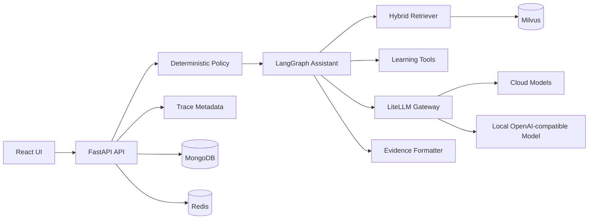

# EduMentor Production Architecture

## Current Target

EduMentor is a FastAPI + React learning assistant with LangGraph orchestration, Milvus retrieval, MongoDB user history, LiteLLM model gateway, Redis cache foundation, and offline RAG evaluation.

## High-Level Flow

## Production Boundaries Added

- Config validation blocks default secrets and wildcard CORS in production.
- Request IDs are added to every API response.
- Readiness separates app liveness from dependency availability.
- Evidence metadata includes document ID, chunk ID, document version, and index version.
- Offline eval harness records retrieval metrics.
- LLM gateway boundary supports logical routes and fallback.
- Deterministic guardrails block prompt injection and PII requests.
- Cache keys include tenant, index, model, prompt, and policy dimensions.
- Trace metadata hashes user identifiers.

## Remaining Work

- Replace direct Gemini calls inside LangGraph nodes with `LLMClient`.
- Run full 80-120 sample eval on real course data.
- Wire Redis retrieval cache and Langfuse runtime spans.
- Run fresh VM deployment, backup/restore drill, and load tests.
