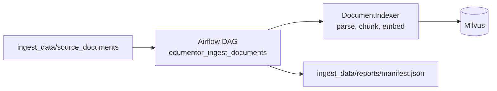

# EduMentor Airflow Ingestion

This stack adds the missing RAGOps ingestion layer for EduMentor.

## Flow



## Run

Start the main RAG infrastructure first:

```powershell
docker compose up -d redis mongodb etcd minio standalone litellm
```

Then start Airflow:

```powershell
cd ingest_data
docker compose up -d --build
```

Open Airflow at `http://localhost:8080` and log in with `airflow` / `airflow`.

Put `.txt`, `.doc`, `.docx`, or `.pdf` files in `ingest_data/source_documents`, then trigger:

```text
edumentor_ingest_documents
```

The DAG writes an idempotency manifest to `ingest_data/reports/manifest.json`.

## Notes

- `.txt` and `.docx` ingestion runs locally.
- `.pdf` ingestion uses the existing Mistral OCR path and requires `MISTRAL_API_KEY`.
- The DAG talks to Milvus via `MILVUS_HOST` and `MILVUS_PORT`; from Docker Desktop the default host is `host.docker.internal`.
