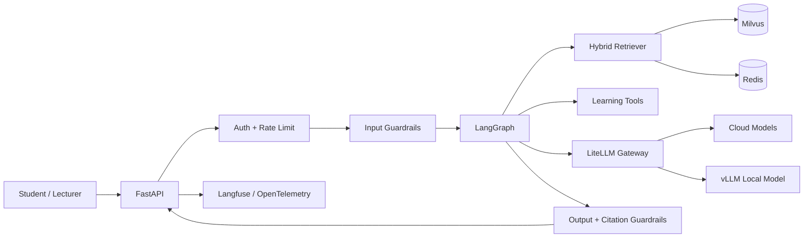

# EduMentor Production RAG LLMOps Implementation Plan

> For agentic workers: REQUIRED SUB-SKILL: use `superpowers:subagent-driven-development` when available, otherwise use `superpowers:executing-plans`. Steps use checkbox syntax for tracking.

**Goal:** Turn `C:\LEARN\EduMentor-AI` from prototype RAG/LangGraph app into a deployable, measurable, safer production RAG/LLMOps portfolio system.

**Architecture:** Keep current FastAPI + React + LangGraph + Milvus + MongoDB shape. Add production boundaries in thin vertical slices: config/security, versioned evidence, evals, model gateway, guardrails, cache, tracing, persistence, deployment, portfolio artifacts.

**Tech Stack:** Python/FastAPI, LangGraph, Milvus, MongoDB, Redis, LiteLLM, Langfuse/OpenTelemetry, pytest, Docker Compose, React/Vite.

## Global Constraints

- Do not rewrite the app from scratch.
- Do not replace Milvus or current hybrid retriever unless eval proves it.
- Do not add Kubernetes before VM Docker Compose is stable.
- Every behavior change needs tests first.
- Every phase ends with verification and a git commit.
- Production claims require raw evidence: tests, eval reports, traces, screenshots, load reports, or deployment docs.
- Keep UI changes minimal unless needed for demo.
- Do not commit `.env`, logs, local uploads, DB volumes, or generated secrets.

## Phase Order

1. [Phase 00 - Superpowers Plan And Execution Contract](phase-00-superpowers-plan-and-execution-contract.md)
2. [Phase 00A - Repository Structure Cleanup](phase-00a-repository-structure-cleanup.md)
3. [Phase 01 - Reproducible Baseline And Security](phase-01-reproducible-baseline-and-security.md)
4. [Phase 02 - Versioned Ingestion And Evidence Contract](phase-02-versioned-ingestion-and-evidence-contract.md)
5. [Phase 03 - Evaluation First RAG](phase-03-evaluation-first-rag.md)
6. [Phase 04 - LLM Gateway And Model Routing](phase-04-llm-gateway-and-model-routing.md)
7. [Phase 05 - Deterministic Guardrails And Citation Verification](phase-05-deterministic-guardrails-and-citation-verification.md)
8. [Phase 06 - Version Aware Redis Cache](phase-06-version-aware-redis-cache.md)
9. [Phase 07 - LangGraph Persistence And Reliability](phase-07-langgraph-persistence-and-reliability.md)
10. [Phase 08 - Observability And LLMOps Dashboard](phase-08-observability-and-llmops-dashboard.md)
11. [Phase 09 - Deployment And Operations](phase-09-deployment-and-operations.md)

## Fast Track

If time is limited, implement in this order:

1. Phase 01
2. Phase 02 minimal evidence contract
3. Phase 03 smoke eval
4. Phase 04 LiteLLM boundary and fallback tests
5. Phase 05 citation + injection vertical slice
6. Phase 08 minimal Langfuse tracing
7. Phase 09 VM Compose staging
8. Phase 10 reports and demo

## Definition Of Done

- Versioned eval dataset and regression gate exist.
- Model gateway supports tested routing and fallback.
- Retrieval and answers carry verifiable evidence IDs.
- Cache is scoped and invalidated by index/model/prompt/policy version.
- Guardrails include deterministic policy gates plus tests.
- Traces show request -> graph node -> retrieval/tool -> LLM -> output gate.
- Deployment can be repeated from README on a fresh machine.
- Portfolio claims map to code, tests, reports, traces, or deployment artifact.

---

**Ngay lap:** 2026-08-10  
**Muc tieu:** bien EduMentor tu prototype RAG/LangGraph thanh mot he thong AI tro giang co the deploy, danh gia, quan sat va bao ve khi phong van AI Engineer Junior+/Middle-.  
**Pham vi:** AI backend, RAG, LLMOps, reliability va deployment. UI chi thay doi khi can cho demo.

## 1. Baseline da audit

### Diem manh hien co

- FastAPI API va React UI.
- LangGraph workflow gom intent analysis, retrieval, tool execution, response generation va source formatting.
- Hybrid retrieval: Milvus vector search + BM25 + weighted merge + semantic reranking.
- Ho tro PDF, PPTX, DOCX, TXT va metadata tai lieu.
- Learning tools: quiz, flashcard, study plan, concept explanation, summary, mind map va progress tracking.
- JWT authentication va MongoDB conversation history.

### Khoang trong can dong

- Model dang couple truc tiep vao Gemini; chua co model abstraction, routing, fallback va usage control.
- Chua co retrieval/answer evaluation dataset va regression gate.
- Chua co tracing, cost/token metrics, p50/p95 latency va cache hit rate.
- Chua co Redis cache va invalidation theo document/index version.
- Chua co input/output/tool guardrails, citation verification va academic-integrity policy ro rang.
- LangGraph chua co production checkpointer/resume contract.
- Docker Compose moi chay Milvus stack; chua dong goi API, UI, MongoDB, Redis, gateway va observability.
- Test rat mong; chua co dependency lockfile va CI gate.
- Wildcard CORS va JWT default chua an toan cho deployment.

## 2. Dinh vi portfolio

> **EduMentor AI | Personal Project - Production RAG & LLMOps Platform for Technical Education**

- Du an lab the hien product architecture, leadership, PBL/Git/course workflow va academic use case.
- EduMentor the hien hands-on production RAG, model gateway/serving, eval, observability, guardrails, cache va deployment.
- Khong can them mot project RAG khac neu EduMentor dat Definition of Done ben duoi. Mot system chay that co benchmark manh hon nhieu prototype trung lap.

## 3. Kien truc dich

### Nguyen tac

1. Tao eval baseline truoc khi thay retrieval/model.
2. Gateway la OpenAI-compatible boundary; LangGraph khong phu thuoc provider.
3. Cache key phai gom course/user scope, index, model, prompt va policy version.
4. Policy ro rang dung deterministic gate; LLM judge chi la lop bo sung.
5. Moi claim CV phai map toi code, test, dashboard, report hoac deployment.

## 4. Metrics can do

- Retrieval: Recall@5/10, MRR, nDCG@10.
- Answer: groundedness, citation precision/recall, relevance, no-answer accuracy.
- Agent: intent accuracy, tool-selection accuracy, invalid-tool-call rate.
- Safety: injection block rate, PII leakage, academic-policy compliance.
- Reliability: p50/p95, error rate, fallback success, cache hit rate, restart recovery.
- Cost: input/output tokens va estimated cost theo model, route va use case.

## 5. Roadmap 6 tuan

## Phase 0 - Reproducible baseline va security

**Thoi gian:** 2-3 ngay

### Cong viec

- Tao `pyproject.toml`, lock dependency va chot Python version.
- Tao `.env.example`; validate secret/config khi startup.
- Thay wildcard CORS bang environment allowlist.
- Them structured logging, request ID, health va readiness.
- Tao API Dockerfile va test skeleton cho API, graph, retriever, config.
- Luu baseline response/latency trong `reports/baseline-v1.md`.

### Acceptance gate

- `pytest` chay trong clean environment.
- Readiness phan anh dung MongoDB/Milvus dependency state.
- Production profile khong co default JWT secret hoac wildcard CORS.
- Clone moi co the khoi dong theo README ma khong sua code.

### Hoc de phong van

Dependency pinning, 12-factor config, health vs readiness, secret handling, structured logs.

## Phase 1 - Evaluation-first RAG

**Thoi gian:** 4-5 ngay

### Cong viec

- Tao 80-120 cau hoi tu 3-5 mon ky thuat: single-chunk, multi-chunk, slide/table, no-answer, ambiguous va document injection.
- Moi sample co question, expected answer, evidence IDs, course, difficulty va category.
- Tao offline retrieval eval va answer eval; pin judge prompt/model/version.
- Luu raw output, aggregate metrics va error taxonomy.
- CI chay smoke subset; full eval chay nightly/manual.

### Tep du kien

- `evals/datasets/edumentor_v1.jsonl`
- `evals/retrieval_eval.py`
- `evals/answer_eval.py`
- `evals/metrics.py`
- `reports/eval-baseline-v1.md`

### Acceptance gate

- Co Recall@5/10, MRR, groundedness va citation precision/recall baseline.
- Ket qua mang dataset/model/prompt/index version.
- Co 10 failure cases phan tich thu cong va regression threshold.

### Hoc de phong van

Gold evidence, offline/online eval, LLM judge bias, regression gates, error analysis.

## Phase 2 - LiteLLM gateway va vLLM routing

**Thoi gian:** 4-5 ngay

### Cong viec

- Tao `LLMClient` boundary dung OpenAI-compatible API.
- Deploy LiteLLM Proxy trong Compose.
- Tao logical models: `edumentor-fast`, `edumentor-quality`, `edumentor-local`.
- Route simple intent/tool tasks sang fast/local model; grounded reasoning sang quality model.
- Cau hinh timeout, bounded retry, fallback va metadata propagation.
- Theo doi token, latency, provider, model, status va estimated cost.
- Test provider timeout, 429, 5xx va malformed response.

### Tep du kien

- `core/llm_client.py`
- `core/model_policy.py`
- `infrastructure/litellm/config.yaml`
- `tests/core/test_model_policy.py`
- `tests/integration/test_gateway_fallback.py`

### Acceptance gate

- Doi provider khong sua LangGraph nodes.
- Automated test chung minh route va fallback.
- Eval report so sanh it nhat hai model tren cung dataset.
- Neu vLLM moi chay local/staging thi CV phai ghi self-hosted, khong ghi production.

### Hoc de phong van

Gateway vs inference server, vLLM, routing policy, timeout/retry/fallback, cost-quality tradeoff.

## Phase 3 - Version-aware Redis cache

**Thoi gian:** 3-4 ngay

### Thu tu

1. Embedding cache.
2. Retrieval-result cache.
3. Pure/idempotent tool-output cache.
4. Answer cache chi lam khi scope/invalidation da ro.

### Cong viec

- Key gom course, normalized-query hash, index version, embedding model va retriever config.
- Invalidate khi re-index hoac model/policy version thay doi.
- Khong cache PII, progress ca nhan hoac sensitive tool output.
- Them bounded TTL va stampede protection.
- Benchmark replay workload truoc/sau.

### Acceptance gate

- Khong cross-course/cross-user cache leakage.
- Re-index lam version cu het hieu luc.
- Report co hit rate, p50/p95 va token/cost delta kem raw result.

### Hoc de phong van

Cache-aside, invalidation, multitenancy, semantic-cache risk, TTL va stampede.

## Phase 4 - End-to-end tracing va observability

**Thoi gian:** 3-4 ngay

### Cong viec

- Instrument FastAPI, LangGraph nodes, retriever, tools va LLM calls.
- Dung Langfuse cho prompt/LLM traces; OpenTelemetry cho system traces/metrics neu can.
- Redact token, secret, PII va sensitive document text.
- Gan trace ID, thread ID, user hash, course, model/prompt/index version.
- Dashboard: request/error rate, p50/p95, token/cost, retrieval latency, cache hit, fallback va guardrail block rate.
- Tao runbook cho nam failure modes pho bien.

### Acceptance gate

- Truy nguoc duoc mot response qua node, tool, retrieval va model call.
- Trace khong chua secret.
- Co dashboard screenshot va runbook trong portfolio.

### Hoc de phong van

Logs vs metrics vs traces, propagation, cardinality, redaction, SLI/SLO.

## Phase 5 - Guardrails va academic integrity

**Thoi gian:** 4-5 ngay

### Lop bao ve

- Input: schema/size validation, injection heuristics, PII, course authorization.
- Retrieval: ACL pre-filter, untrusted-document marking, provenance.
- Tool: typed schema, allowlist, timeout, output limit, approval.
- Output: citation verification, unsupported claim, PII redaction, no-answer.
- Education: Socratic hints, assignment/exam policy va lecturer approval.

### Cong viec

- Policy engine deterministic voi ba outcome: allow, block, require approval.
- LLM judge chi xu ly semantic case khong the viet rule ro rang.
- Adversarial tests: direct/indirect injection, citation spoof, cross-course access, answer-the-exam.
- Audit decision khong luu chain-of-thought.
- HITL interrupt/resume cho sensitive action.

### Acceptance gate

- Injection va cross-course tests pass.
- Tool can approval khong chay khi thieu approval.
- Citation verifier tu choi source ID/version khong ton tai.
- Co false-positive/false-negative report.

### Hoc de phong van

Prompt injection, least privilege, deterministic gates, HITL va auditability.

## Phase 6 - RAG reliability va persistent state

**Thoi gian:** 4-5 ngay

### Cong viec

- Them document/index version va ingestion-job state.
- Tach ingestion khoi request path; retry-safe va idempotent.
- Them LangGraph checkpointer theo `thread_id`; test pause/resume va restart.
- Chuan hoa evidence contract: document/chunk ID, page/slide, version, score.
- Citation-required generation va no-answer threshold.
- Ablation: vector-only, BM25-only, hybrid, hybrid+rereanker.
- Chi xem xet OpenSearch/GraphRAG khi eval va scale chung minh nhu cau.

### Acceptance gate

- Restart khong mat approved workflow state.
- Retry ingestion khong tao duplicate chunks.
- Response chi cite dung document version.
- Co ablation report va rationale chon retrieval stack.

### Hoc de phong van

Idempotency, checkpointing, state machine, consistency, hybrid search va reranking.

## Phase 7 - Deployment va operations

**Thoi gian:** 5-6 ngay

### Uu tien

1. Docker Compose tren mot VM.
2. CI/CD, backup, monitoring va rollback.
3. Kubernetes/Helm chi sau khi VM deployment on dinh.

### Cong viec

- Compose profiles cho API, UI, MongoDB, Redis, Milvus, LiteLLM va observability.
- Reverse proxy + TLS; secret nam ngoai image/repo.
- CI: lint, unit, integration, eval smoke, image build va security scan.
- CD staging: compatibility check, smoke test va rollback.
- Backup/restore MongoDB va Milvus object/metadata; dien tap restore.
- Load test: cache miss, cache hit va ingestion.
- Failure test: provider down, Redis down, Milvus slow, worker restart.
- Viet deployment guide, runbook va postmortem template.

### Acceptance gate

- Fresh VM deploy duoc tu README.
- Co HTTPS, probes, backup/restore va rollback procedure.
- Report co p50/p95, error rate va resource usage.
- Failure matrix mo ta graceful degradation.

### Hoc de phong van

Container networking, reverse proxy, CI/CD gates, rollback, backup, load test va degradation.

## Phase 8 - Portfolio va interview defense

**Thoi gian:** 2-3 ngay

### Artifact bat buoc

- README co problem, architecture, setup, demo va measured results.
- Architecture document va 2-3 ADRs.
- Baseline/final eval reports.
- Load-test va failure-injection reports.
- Dashboard/tracing screenshots da redact.
- Demo script 3-5 phut.
- Interview notes: retrieval, gateway/vLLM, cache invalidation, injection, persistence, p95 bottleneck, incident va rejected tradeoff.

### CV claim ladder

**Co the ghi ngay:**

- Built a LangGraph-based learning assistant with hybrid BM25/vector retrieval, semantic reranking, source-aware responses, persistent conversation history, and specialized learning tools.
- Developed document-grounded workflows for quiz, flashcard, summary, study-plan, and concept generation over PDF, PPTX, and DOCX course materials.

**Chi ghi sau Phase 2-5:**

- Implemented a self-hosted LiteLLM gateway routing requests across cloud and vLLM-hosted models with timeout, fallback, usage tracking, and trace propagation.
- Added version-aware Redis caching, end-to-end LLM tracing, and layered prompt-injection, citation, PII, and academic-integrity guardrails.

**Chi ghi sau Phase 7-8 va co report:**

- Deployed and evaluated the platform on [environment], achieving [measured p95], [retrieval metric], [groundedness], and [cache/cost delta] on a versioned benchmark.

Khong dien so uoc luong vao ngoac vuong. Chua co raw report thi chua co metric CV.

## 6. Lich hoc nhanh

### Moi ngay 2.5-3 gio

- 30 phut ly thuyet dung voi phase hien tai.
- 90 phut implement mot vertical slice.
- 30 phut test/eval va doc trace.
- 20 phut viet engineering note/ADR.
- 10 phut tap tra loi why, tradeoff va failure mode.

### Moi tuan phai tao ra

- Mot feature chay duoc.
- Mot automated test/eval gate.
- Mot measured artifact.
- Mot architecture/tradeoff note.
- Mot demo scenario.
- Nam cau hoi phong van co cau tra loi tu code cua chinh du an.

## 7. Fast track neu apply trong 3 tuan

1. Phase 0: reproducibility + security.
2. Phase 1: eval baseline.
3. Phase 2: LiteLLM gateway + fallback.
4. Phase 4: tracing/dashboard.
5. Phase 5: mot guardrail vertical slice.
6. Phase 7: Docker Compose staging.
7. Viet report va demo; cache/Kubernetes lam sau.

Day la duong ngan nhat de tu “biet LangChain/LangGraph” thanh “da van hanh mot LLM system co eval va production evidence”.

## 8. Definition of Done

- Co versioned dataset va regression evaluation.
- Co model gateway va tested fallback.
- Co trace end-to-end va measured p95/token/cost.
- Co cache isolation/invalidation tests.
- Co deterministic safety/authorization gates.
- Co persistent state va idempotent ingestion.
- Co repeatable deployment, backup/restore va rollback.
- Co report voi raw/reproducible evidence.
- Co the ve kien truc, giai thich ba tradeoff va ke mot failure/postmortem.

## 9. Khong lam som

- Khong them GraphRAG chi de co keyword; chi them khi multi-hop eval cho thay graph expansion can thiet.
- Khong dung semantic answer cache truoc tenant isolation va invalidation.
- Khong deploy Kubernetes chi de ghi CV; VM Compose co SLO, backup, tracing va rollback co gia tri hon.
- Khong them multi-agent neu mot graph deterministic da du; chi tach agent khi co ownership/context/tool boundary ro.
- Khong thay retriever/reranker theo cam tinh; moi thay doi phai qua eval.
